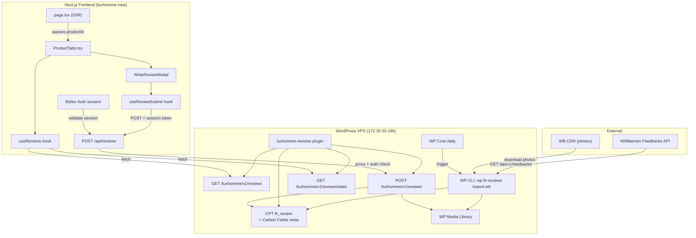

# Архитектурное решение: Система отзывов Luxhomme

## Обзор решения

Система отзывов строится как WordPress-плагин `luxhomme-reviews` (бэкенд) + набор клиентских хуков и компонентов в Next.js (фронтенд). Плагин регистрирует CPT `lh_review` с Carbon Fields мета-полями, предоставляет REST API (`luxhomme/v1`) и WP-CLI команду для импорта 5-звёздочных отзывов с фото из Wildberries. Фронтенд загружает отзывы client-side через кастомный хук `useReviews`, отправляет новые отзывы через `POST` с проверкой Better Auth сессии, и отображает всё в существующей секции `ProductTabs`.

---

## Архитектурная диаграмма



---

## Структура плагина `luxhomme-reviews`

```
wp-content/plugins/luxhomme-reviews/
├── luxhomme-reviews.php          # Plugin header, bootstrap, autoload
├── includes/
│   ├── class-lhr-post-type.php   # CPT registration + Carbon Fields
│   ├── class-lhr-rest-api.php    # REST endpoints (GET/POST/stats)
│   ├── class-lhr-admin.php       # Admin columns, filters, menu
│   ├── class-lhr-wb-importer.php # WB API client, import logic
│   └── class-lhr-cli.php         # WP-CLI command
└── README.md
```

### Принцип загрузки

```php
// luxhomme-reviews.php
add_action('after_setup_theme', function() {
    require_once __DIR__ . '/includes/class-lhr-post-type.php';
    require_once __DIR__ . '/includes/class-lhr-rest-api.php';
    require_once __DIR__ . '/includes/class-lhr-admin.php';
    require_once __DIR__ . '/includes/class-lhr-wb-importer.php';
    if (defined('WP_CLI') && WP_CLI) {
        require_once __DIR__ . '/includes/class-lhr-cli.php';
    }
});
```

---

## Схема данных: CPT `lh_review` + Carbon Fields

### CPT Registration

```php
register_post_type('lh_review', [
    'labels'              => [...],
    'public'              => false,
    'publicly_queryable'  => false,
    'show_ui'             => true,
    'show_in_menu'        => true,
    'menu_icon'           => 'dashicons-star-filled',
    'menu_position'       => 25,
    'supports'            => ['title', 'editor'],
    'show_in_rest'        => false, // свой REST, не WP стандартный
]);
```

### Carbon Fields meta-поля

| Поле                 | Тип CF                  | Хранение в `wp_postmeta` | Описание                |
| -------------------- | ----------------------- | ------------------------ | ----------------------- |
| `review_rating`      | `select` (1–5)          | `_review_rating`         | Оценка (обязательное)   |
| `review_product_id`  | `text` (WC product ID)  | `_review_product_id`     | ID товара WooCommerce   |
| `review_source`      | `select` (`site`, `wb`) | `_review_source`         | Источник отзыва         |
| `review_author_name` | `text`                  | `_review_author_name`    | Имя автора              |
| `review_external_id` | `text`                  | `_review_external_id`    | ID из WB (дедупликация) |
| `review_photos`      | `media_gallery` (image) | `_review_photos`         | Массив attachment ID    |

**Решение по `review_product_id`**: используем простое `text`-поле с WC product ID (число) вместо `association`. Причина: `association` хранит сложную сериализованную структуру, которую тяжело использовать в `meta_query`. Текстовое поле с числовым ID позволяет эффективную фильтрацию через `WP_Query`.

**`post_content`** (стандартный editor): хранит текст отзыва. Это позволяет использовать стандартный поиск WP и избежать дублирования в мета-поле.

**`post_title`**: автогенерируемый — `"Отзыв от {author_name} — {product_name}"`.

**Статусы WP**: `publish` (опубликован, виден на фронте), `draft` (черновик, на модерации).

---

## REST API контракты

**Namespace**: `luxhomme/v1`  
**Base**: `https://wp.saudagar-group.ru/wp-json/luxhomme/v1`

### GET `/reviews`

Получить опубликованные отзывы для товара.

```
GET /luxhomme/v1/reviews?product_id=123&page=1&per_page=10&source=wb
```

**Query params:**

| Param        | Type   | Required | Default | Description                 |
| ------------ | ------ | -------- | ------- | --------------------------- |
| `product_id` | int    | yes      | —       | WooCommerce product ID      |
| `page`       | int    | no       | 1       | Страница                    |
| `per_page`   | int    | no       | 10      | Кол-во на странице (max 50) |
| `source`     | string | no       | —       | Фильтр: `site`, `wb`        |

**Response 200:**

```typescript
interface ReviewsResponse {
  reviews: Review[]
  total: number
  pages: number
}

interface Review {
  id: number
  rating: number // 1–5
  text: string // post_content (sanitized)
  author_name: string
  source: 'site' | 'wb'
  photos: string[] // массив URL (wp_get_attachment_image_url)
  date: string // ISO 8601 (post_date)
  product_id: number
}
```

**Доступ**: без авторизации. CORS-заголовки для фронтенд-домена.

### GET `/reviews/stats`

Агрегированная статистика по товару.

```
GET /luxhomme/v1/reviews/stats?product_id=123
```

**Response 200:**

```typescript
interface ReviewStatsResponse {
  average_rating: number // float, 1 decimal (e.g. 4.7)
  total_count: number
  with_photos_count: number
  distribution: {
    // кол-во отзывов по каждой оценке
    '1': number
    '2': number
    '3': number
    '4': number
    '5': number
  }
}
```

### POST `/reviews`

Создать отзыв (как черновик для модерации).

```
POST /luxhomme/v1/reviews
Content-Type: multipart/form-data
```

**Form fields:**

| Field           | Type    | Required | Validation                             |
| --------------- | ------- | -------- | -------------------------------------- |
| `product_id`    | int     | yes      | Должен быть существующим WC product    |
| `rating`        | int     | yes      | 1–5                                    |
| `text`          | string  | yes      | min 10, max 2000 chars                 |
| `author_name`   | string  | yes      | min 2, max 100 chars                   |
| `photos[]`      | file(s) | no       | max 5 файлов, image/\*, max 5MB каждый |
| `_honeypot`     | string  | no       | Должно быть пустым (антиспам)          |
| `session_token` | string  | yes      | Better Auth session token              |

**Response 201:**

```typescript
interface CreateReviewResponse {
  success: true
  review_id: number
  message: string // "Отзыв отправлен на модерацию"
}
```

**Response 400/401/429:**

```typescript
interface ErrorResponse {
  code: string // 'validation_error' | 'unauthorized' | 'rate_limited'
  message: string
  errors?: Record<string, string> // per-field errors
}
```

**Защита POST-эндпоинта:**

1. Rate limiting: max 3 отзыва в час с одного IP (`wp_transient`)
2. Honeypot: поле `_honeypot` должно быть пустым
3. Авторизация: `session_token` валидируется через проксирующий Next.js API route (см. ниже)
4. Sanitization: `sanitize_text_field()` для текстовых полей, `wp_check_filetype()` для фото

---

## Логика импорта Wildberries

### Маппинг WB → WooCommerce

Парсинг `nmId` из мета-поля `_wb_link` товара:

```
_wb_link = "https://www.wildberries.ru/catalog/12345678/detail.aspx"
→ nmId = 12345678
```

```php
// Regex для извлечения nmId
preg_match('/catalog\/(\d+)/', $wb_link, $matches);
$nm_id = $matches[1] ?? null;
```

**Построение lookup-таблицы при запуске импорта:**

```php
// WP_Query: все products с непустым _wb_link
$products = get_posts([
    'post_type'  => 'product',
    'meta_key'   => '_wb_link',
    'meta_compare' => '!=',
    'meta_value' => '',
    'posts_per_page' => -1,
    'fields' => 'ids',
]);

// Результат: Map<nmId: string, wcProductId: int>
$nm_id_to_product = [];
foreach ($products as $product_id) {
    $wb_link = get_post_meta($product_id, '_wb_link', true);
    if (preg_match('/catalog\/(\d+)/', $wb_link, $m)) {
        $nm_id_to_product[$m[1]] = $product_id;
    }
}
```

### Алгоритм импорта (`LHR_WB_Importer`)

```
1. Построить lookup nmId → wcProductId
2. Для каждого nmId из lookup:
   a. GET feedbacks-api.wildberries.ru/api/v1/feedbacks
      ?isAnswered=true&nmId={nmId}&take=100&skip=0
      Header: Authorization: Bearer {WB_API_KEY}
   b. Пагинация: повторять пока есть данные (skip += take)
   c. Фильтрация: только productValuation == 5 И photos.length > 0
   d. Для каждого отзыва:
      - Проверить дедупликацию: meta_query по _review_external_id = {feedback.id}
      - Если не дубль:
        - Скачать фото с WB CDN → media_sideload_image → attachment ID
        - Создать post lh_review (status: publish)
        - Установить мета-поля через Carbon Fields API
3. Логировать: создано N, пропущено M (дубли), ошибок K
```

### WB API Response (ключевые поля)

```typescript
interface WBFeedback {
  id: string // → review_external_id
  text: string // → post_content
  productValuation: number // → review_rating (фильтр: == 5)
  createdDate: string // ISO date → post_date
  userName: string // → review_author_name
  photos?: Array<{
    fullSize: string // URL фото на CDN → скачать
  }>
  productDetails: {
    nmId: number // для маппинга
  }
}
```

### WB Photo URL

Фото скачиваются с `photos[].fullSize` (обычно `https://feedback01.wbbasket.ru/vol{X}/part{Y}/...`). Используем `media_sideload_image()` — стандартная WP функция, загружает по URL в Media Library и возвращает attachment ID.

### WP-CLI и Cron

```php
// class-lhr-cli.php
WP_CLI::add_command('lh-reviews import-wb', [LHR_CLI::class, 'import_wb']);

// cron в class-lhr-wb-importer.php
add_action('init', function() {
    if (!wp_next_scheduled('lhr_daily_wb_import')) {
        wp_schedule_event(time(), 'daily', 'lhr_daily_wb_import');
    }
});
add_action('lhr_daily_wb_import', [LHR_WB_Importer::class, 'run']);
```

### Конфигурация WB API Key

В `wp-config.php` на VPS добавить:

```php
define('LHR_WB_API_KEY', 'Bearer-токен-от-WB');
```

Плагин читает: `defined('LHR_WB_API_KEY') ? LHR_WB_API_KEY : ''`

---

## Фронтенд: изменения в файлах

### Новые файлы

| Файл                              | Назначение                                                                                 |
| --------------------------------- | ------------------------------------------------------------------------------------------ |
| `src/lib/shop/reviews-api.ts`     | Функции fetch к REST API отзывов: `fetchReviews()`, `fetchReviewStats()`, `submitReview()` |
| `src/hooks/use-reviews.ts`        | React-хук `useReviews(productId)` — загрузка, пагинация, фильтрация                        |
| `src/hooks/use-review-submit.ts`  | React-хук `useReviewSubmit()` — отправка отзыва (form state machine)                       |
| `src/app/api/reviews/route.ts`    | Next.js API route — проксирует POST в WP REST, валидирует Better Auth сессию               |
| `public/icons/wb-logo.svg`        | Иконка Wildberries для бейджа источника                                                    |
| `public/icons/luxhomme-badge.svg` | Иконка сайта для бейджа отзывов с сайта                                                    |

### Изменения в существующих файлах

| Файл                                                | Что меняется                                                                                                           |
| --------------------------------------------------- | ---------------------------------------------------------------------------------------------------------------------- |
| `src/lib/shop/product-detail-ui.ts`                 | Тип `ProductDetailForTabs.reviews` → удалить (отзывы загружаются отдельным хуком). Добавить `productId: string` в тип. |
| `src/app/(shop)/products/[slug]/page.tsx`           | Прокинуть `product.id` в `ProductTabs` (сейчас не передаётся)                                                          |
| `src/app/(shop)/products/[slug]/ProductTabs.tsx`    | Подключить `useReviews`, `useReviewSubmit`; переработать секцию отзывов; обновить `WriteReviewModal`                   |
| `src/app/(shop)/products/[slug]/product.module.css` | Добавить `.sourceBadge`, `.wbBadge`, `.siteBadge`; обновить `.reviewPhoto` → сетка из нескольких фото                  |

---

## Типы и контракты (TypeScript)

```typescript
// src/lib/shop/reviews-api.ts

export interface Review {
  id: number
  rating: number
  text: string
  author_name: string
  source: 'site' | 'wb'
  photos: string[]
  date: string
  product_id: number
}

export interface ReviewStats {
  average_rating: number
  total_count: number
  with_photos_count: number
  distribution: Record<'1' | '2' | '3' | '4' | '5', number>
}

export interface ReviewsPage {
  reviews: Review[]
  total: number
  pages: number
}

export type ReviewFilter = 'all' | 'with_photo' | 'positive' | 'negative'

export interface SubmitReviewPayload {
  product_id: number
  rating: number
  text: string
  author_name: string
  photos: File[]
}

export interface SubmitReviewResult {
  success: boolean
  review_id?: number
  message: string
  errors?: Record<string, string>
}
```

```typescript
// src/hooks/use-reviews.ts

interface UseReviewsReturn {
  reviews: Review[]
  stats: ReviewStats | null
  isLoading: boolean
  error: string | null
  filter: ReviewFilter
  setFilter: (f: ReviewFilter) => void
  page: number
  totalPages: number
  loadMore: () => void
  hasMore: boolean
}

function useReviews(productId: string): UseReviewsReturn
```

```typescript
// src/hooks/use-review-submit.ts

type SubmitStatus = 'idle' | 'submitting' | 'success' | 'error'

interface UseReviewSubmitReturn {
  status: SubmitStatus
  error: string | null
  fieldErrors: Record<string, string>
  submit: (payload: SubmitReviewPayload) => Promise<void>
  reset: () => void
}

function useReviewSubmit(): UseReviewSubmitReturn
```

---

## Обновлённый `ProductDetailForTabs`

```typescript
export type ProductDetailForTabs = {
  productId: string // NEW: WC product ID для fetch отзывов
  descSlides: { image: string; title: string; text: string }[]
  specsGroups?: SpecGroup[]
  specs: {
    /* без изменений */
  }
  accessories: { name: string; image: string; giftBadge?: string }[]
  instructionFiles: { label: string; href: string }[]
  specsDrawingSrc: string
  ratingAvg: string // DEPRECATED: заменяется на stats из useReviews
  // reviews: [...] — УДАЛЕНО: загружаются через useReviews hook
}
```

---

## Связка авторизации: Next.js → WP REST

Прямой вызов WP REST с клиента нежелателен (секретные токены, CORS). Решение — проксирующий Next.js API route:

```
Клиент (browser)
  → POST /api/reviews (Next.js, с cookie better-auth.session_token)
    → Сервер: валидация сессии через auth.api.getSession()
    → Если сессия валидна: forward в WP REST POST /luxhomme/v1/reviews
    → Если нет: 401
```

### `src/app/api/reviews/route.ts`

```typescript
import { auth } from '@/lib/auth'
import { headers } from 'next/headers'
import { NextRequest, NextResponse } from 'next/server'

const WP_REST_BASE = process.env.WOOCOMMERCE_URL + '/wp-json/luxhomme/v1'

export async function POST(request: NextRequest) {
  // 1. Проверить Better Auth сессию
  const session = await auth.api.getSession({ headers: await headers() })
  if (!session?.user) {
    return NextResponse.json(
      { code: 'unauthorized', message: 'Необходимо авторизоваться' },
      { status: 401 },
    )
  }

  // 2. Rate limiting (reuse apiLimiter)

  // 3. Прокинуть FormData в WP REST
  const formData = await request.formData()
  formData.set('session_token', 'validated')
  formData.set('author_name', session.user.name || 'Пользователь')

  const wpRes = await fetch(`${WP_REST_BASE}/reviews`, {
    method: 'POST',
    body: formData,
    // WP REST: Basic Auth для server-to-server
    headers: {
      Authorization: 'Basic ' + btoa(`${WP_APP_USER}:${WP_APP_PASSWORD}`),
    },
  })

  const data = await wpRes.json()
  return NextResponse.json(data, { status: wpRes.status })
}
```

**Почему proxy, а не прямой вызов:**

1. Better Auth сессия живёт в SQLite Next.js сервера — только он может её валидировать
2. WP REST защищён Basic Auth (server-to-server) — credentials не уходят на клиент
3. Единая точка rate limiting
4. Нет CORS-проблем для POST

**GET-запросы** (`/reviews`, `/stats`) идут напрямую с клиента в WP REST (они публичные, read-only). WP добавляет CORS-заголовки для фронтенд-домена.

---

## CORS на WP стороне

В плагине `luxhomme-reviews.php`:

```php
add_action('rest_api_init', function() {
    remove_filter('rest_pre_serve_request', 'rest_send_cors_headers');
    add_filter('rest_pre_serve_request', function($value) {
        $origin = get_http_origin();
        $allowed = ['https://luxhomme.ru', 'http://localhost:3000'];
        if (in_array($origin, $allowed, true)) {
            header('Access-Control-Allow-Origin: ' . $origin);
            header('Access-Control-Allow-Methods: GET, POST, OPTIONS');
            header('Access-Control-Allow-Headers: Content-Type, Authorization');
            header('Access-Control-Allow-Credentials: true');
        }
        return $value;
    });
});
```

---

## Разделение труда

### Для инженера (сложные части):

1. **`includes/class-lhr-wb-importer.php`** — WB API клиент с пагинацией, скачивание фото через `media_sideload_image`, дедупликация, маппинг nmId → product, обработка ошибок API
2. **`includes/class-lhr-rest-api.php`** — REST endpoints с валидацией, загрузкой фото через `wp_handle_upload`, оптимизированные WP_Query с meta_query, CORS, формирование ответов
3. **`src/hooks/use-reviews.ts`** — хук с пагинацией, фильтрацией (клиентской), кэшированием через `useSWR` или ручной стейт
4. **`src/app/api/reviews/route.ts`** — прокси с Better Auth валидацией, rate limiting, проксированием FormData
5. **`src/app/(shop)/products/[slug]/ProductTabs.tsx`** — рефакторинг секции отзывов: подключение хуков, замена статичных данных на динамические, обновление `WriteReviewModal`

### Для разработчика (рутинные части):

1. **`luxhomme-reviews.php`** — plugin header, bootstrap, подключение файлов
2. **`includes/class-lhr-post-type.php`** — регистрация CPT и Carbon Fields полей (по спецификации выше)
3. **`includes/class-lhr-admin.php`** — кастомные колонки в admin list table (товар, рейтинг, источник)
4. **`includes/class-lhr-cli.php`** — WP-CLI обёртка вокруг `LHR_WB_Importer::run()`
5. **`src/lib/shop/reviews-api.ts`** — тонкие обёртки fetch (по контрактам выше)
6. **`src/hooks/use-review-submit.ts`** — хук отправки (простая стейт-машина: idle → submitting → success/error)
7. **`src/lib/shop/product-detail-ui.ts`** — добавить `productId` в тип и `buildProductDetailForTabs()`
8. **`src/app/(shop)/products/[slug]/page.tsx`** — прокинуть `product.id` в `tabsProduct`
9. **`product.module.css`** — стили `.sourceBadge`, `.wbBadge`, `.siteBadge`, обновить `.reviewPhoto` на сетку
10. **SVG-иконки** — `wb-logo.svg`, `luxhomme-badge.svg`

---

## NFR: Реализационные решения

| NFR                | Решение                                                                                           |
| ------------------ | ------------------------------------------------------------------------------------------------- |
| NFR-1 (LCP)        | Отзывы загружаются client-side через `useReviews` — не блокируют SSR/LCP                          |
| NFR-2 (Кэш)        | GET-запросы: WP отдаёт `Cache-Control: public, max-age=300`. Next.js не кэширует (client fetch)   |
| NFR-3 (Rate limit) | WP: `wp_transient` rate limit на POST (3/час/IP). Next.js: `apiLimiter` на proxy route            |
| NFR-4 (Фото)       | WP auto-resize при upload (add_image_size). WebP — если плагин установлен, работает автоматически |
| NFR-5 (Мобайл)     | CSS уже частично адаптирован. Проверить modal + photo grid на мобильных                           |
| NFR-6 (SEO)        | JSON-LD `AggregateRating` + `Review` генерируется в `page.tsx` через серверный fetch stats        |

### SEO: JSON-LD разметка

Статистику отзывов (`/reviews/stats`) запрашиваем на сервере в `page.tsx` и рендерим JSON-LD:

```typescript
// В page.tsx — серверный fetch
const statsRes = await fetch(`${WP_REST_BASE}/reviews/stats?product_id=${product.id}`)
const stats = await statsRes.json()

// В head через <script type="application/ld+json">
{
  "@context": "https://schema.org",
  "@type": "Product",
  "name": product.name,
  "aggregateRating": {
    "@type": "AggregateRating",
    "ratingValue": stats.average_rating,
    "reviewCount": stats.total_count
  }
}
```
