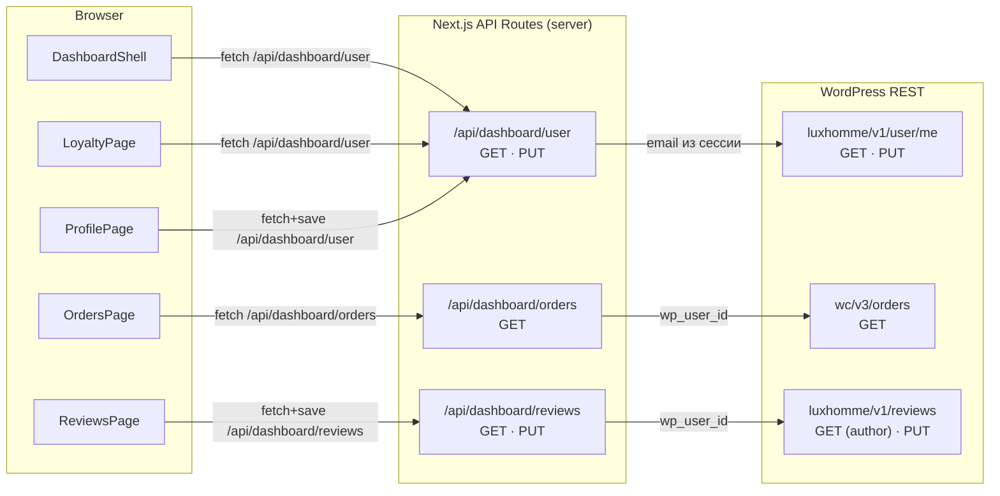

# Architect Output — task-02-dashboard-integration

## Обзор решения

Интеграция личного кабинета реализуется по паттерну **«тонкий клиент → Next.js API Route → WP/WC REST»**, уже используемому в `src/app/api/reviews/route.ts`. Маппинг Better Auth ↔ WP User ID выполняется по email через кастомный WP REST endpoint `/luxhomme/v1/user/me`. На стороне WordPress добавляются 4 endpoint'а (user/me GET/PUT, reviews по author, reviews PUT). На стороне Next.js — 3 API Route, которые валидируют сессию, резолвят WP user по email и проксируют запрос.

---

## Архитектурная диаграмма



---

## Решение маппинга Better Auth → WP User ID

**Подход:** при каждом запросе к dashboard API Route:

1. Валидировать Better Auth сессию → получить `session.user.email`.
2. Передать email в WP endpoint `GET /luxhomme/v1/user/me?email=<email>`.
3. PHP-endpoint ищет WP user по email (`get_user_by('email', ...)`) и возвращает данные вместе с `wp_user_id`.
4. API Route использует полученный `wp_user_id` для запросов к WC Orders и Reviews.

**Почему этот подход, а не хранение маппинга в Better Auth:**

- Не требует миграции схемы Better Auth SQLite.
- Email уникален в обеих системах (Better Auth и WordPress).
- Один дополнительный запрос к WP — допустимо для dashboard (не high-traffic).
- Для orders и reviews `wp_user_id` берётся из того же ответа `user/me` — один fetch на всю цепочку.

**Утилита `resolveWpUser`** — серверная функция, вынесенная в `src/lib/dashboard/wp-user.ts`, чтобы все 3 API Route переиспользовали логику «сессия → email → WP user data».

---

## PHP: кастомные WP REST endpoints

Все endpoint'ы регистрируются в одном файле: `wp-content/themes/norebro/inc/rest-dashboard.php`, подключаемом из `functions.php`.

### 1. GET `/luxhomme/v1/user/me`

**Параметры:** `email` (required, string)  
**Auth:** WC Consumer Key/Secret (Basic Auth) — server-to-server  
**Логика:**

- `get_user_by('email', $email)` → если не найден, 404
- Читает user meta: `bonus_balance`, `total_spent`, `user_rank`, `billing_phone`, `billing_address_1`, `billing_city`, `billing_country`, `billing_postcode`
- Читает `first_name`, `last_name`, `display_name`, `user_email`

**Response:**

```json
{
  "wp_user_id": 42,
  "display_name": "Иван Иванов",
  "first_name": "Иван",
  "last_name": "Иванов",
  "email": "ivan@example.com",
  "phone": "+79991234567",
  "address": {
    "address_1": "ул. Профсоюзная",
    "city": "Москва",
    "country": "RU",
    "postcode": "117393"
  },
  "bonus_balance": 500,
  "total_spent": 12500,
  "user_rank": "newby"
}
```

### 2. PUT `/luxhomme/v1/user/me`

**Auth:** WC Consumer Key/Secret (Basic Auth)  
**Body (JSON):**

```json
{
  "email": "ivan@example.com",
  "first_name": "Иван",
  "last_name": "Иванов",
  "phone": "+79991234567",
  "address_1": "ул. Профсоюзная",
  "city": "Москва",
  "postcode": "117393"
}
```

**Логика:**

- `get_user_by('email', $body['email'])` → 404 если не найден
- `wp_update_user()` для `first_name`, `last_name`, `display_name`
- `update_user_meta()` для `billing_phone`, `billing_address_1`, `billing_city`, `billing_postcode`
- Не позволяет менять `email`, `bonus_balance`, `total_spent`, `user_rank` (read-only)

**Response:** тот же формат, что GET (возвращает обновлённые данные).

### 3. GET `/luxhomme/v1/reviews` — добавить фильтр `author_id`

**Изменение в существующем endpoint:** добавить optional параметр `author_id` (int).  
Если передан `author_id` вместо `product_id` — вернуть все отзывы данного автора.  
`product_id` остаётся обязательным при отсутствии `author_id` (обратная совместимость).

**Response** (без изменений формата):

```json
{
  "reviews": [
    {
      "id": 123,
      "rating": 4,
      "text": "Отличный товар",
      "author_name": "Иван",
      "source": "site",
      "photos": ["https://..."],
      "date": "2026-03-29",
      "product_id": 456
    }
  ],
  "total": 5,
  "pages": 1
}
```

### 4. PUT `/luxhomme/v1/reviews/<id>`

**Новый endpoint.**  
**Auth:** WC Consumer Key/Secret (Basic Auth)  
**Body:** `multipart/form-data` (для поддержки загрузки фото) или JSON:

```json
{
  "author_email": "ivan@example.com",
  "rating": 5,
  "text": "Обновлённый отзыв",
  "photos": []
}
```

**Логика:**

- Найти отзыв по `$id`
- Проверить, что `author_email` совпадает с автором отзыва (защита от чужого редактирования)
- Обновить `post_content` (текст), `review_rating` (мета), фото
- Не позволяет менять `source`, `product_id`

**Response:**

```json
{
  "success": true,
  "review": { ...обновлённый отзыв в формате Review... }
}
```

---

## Новые файлы и структуры (Next.js)

### `src/lib/dashboard/wp-user.ts`

Серверная утилита для резолва WP user из Better Auth сессии.

**Экспортирует:**

- `resolveWpUser(session)` → `Promise<WpUserData | null>` — берёт email из сессии, запрашивает `GET /luxhomme/v1/user/me?email=...`
- `wpDashboardFetch(path, options?)` — аналог `wcFetch`, но для `luxhomme/v1/*` endpoints с WP Application Password auth

**Зависит от:** `src/lib/auth.ts`, env-переменные `WOOCOMMERCE_URL`, `WOOCOMMERCE_CONSUMER_KEY`, `WOOCOMMERCE_CONSUMER_SECRET`

### `src/lib/dashboard/types.ts`

Типы и контракты для dashboard API (см. секцию «Типы и контракты»).

**Экспортирует:** все TypeScript-интерфейсы для dashboard: `WpUserData`, `DashboardUserResponse`, `DashboardOrdersResponse`, `DashboardOrder`, `DashboardReview`, `DashboardReviewsResponse`, `UpdateProfilePayload`, `UpdateReviewPayload`, `LoyaltyRank`, `RANK_SETTINGS`.

### `src/lib/dashboard/loyalty.ts`

Чистые функции для вычисления лояльности.

**Экспортирует:**

- `RANK_SETTINGS` — таблица уровней (зеркало PHP `get_rank_settings()`)
- `computeLoyaltyProgress(totalSpent, userRank)` → `{ currentRank, nextRank, progressPercent, currentMinAmount, nextMinAmount }`

**Зависит от:** только `types.ts` (чистые функции, без I/O)

### `src/lib/dashboard/api-client.ts`

Клиентские функции для вызова dashboard API Routes из React-компонентов.

**Экспортирует:**

- `fetchDashboardUser()` → `Promise<DashboardUserResponse>`
- `updateDashboardUser(payload)` → `Promise<DashboardUserResponse>`
- `fetchDashboardOrders()` → `Promise<DashboardOrdersResponse>`
- `fetchDashboardReviews()` → `Promise<DashboardReviewsResponse>`
- `updateDashboardReview(id, payload)` → `Promise<{ success: boolean }>`

**Зависит от:** `types.ts` (типы), browser `fetch` к `/api/dashboard/*`

### `src/app/api/dashboard/user/route.ts`

API Route: GET и PUT для профиля + бонусов.

**GET:**

1. `auth.api.getSession()` → 401 если нет
2. `resolveWpUser(session)` → 404/502 если WP user не найден
3. Вернуть `DashboardUserResponse`

**PUT:**

1. `auth.api.getSession()` → 401
2. Прочитать JSON body → `UpdateProfilePayload`
3. `PUT /luxhomme/v1/user/me` с `{ email: session.user.email, ...payload }`
4. Вернуть обновлённые данные

**Зависит от:** `auth.ts`, `wp-user.ts`, `types.ts`

### `src/app/api/dashboard/orders/route.ts`

API Route: GET для заказов.

**GET:**

1. `auth.api.getSession()` → 401
2. `resolveWpUser(session)` → получить `wp_user_id`
3. `wcFetch('orders', { customer: wp_user_id, per_page: 50 })` (переиспользовать `wcFetch` из woocommerce.ts или дублировать паттерн — дублировать, т.к. `wcFetch` завязан на `revalidate` теги для продуктов)
4. Маппинг WC Order → `DashboardOrder`
5. Вернуть `DashboardOrdersResponse`

**Зависит от:** `auth.ts`, `wp-user.ts`, `types.ts`, env-переменные WC

### `src/app/api/dashboard/reviews/route.ts`

API Route: GET и PUT для отзывов пользователя.

**GET:**

1. `auth.api.getSession()` → 401
2. `resolveWpUser(session)` → получить `wp_user_id`
3. `GET /luxhomme/v1/reviews?author_id=<wp_user_id>`
4. Вернуть `DashboardReviewsResponse`

**PUT:**

1. `auth.api.getSession()` → 401
2. Прочитать body (FormData или JSON)
3. `PUT /luxhomme/v1/reviews/<id>` с `author_email` из сессии
4. Вернуть результат

**Зависит от:** `auth.ts`, `wp-user.ts`, `types.ts`

### `src/app/(dashboard)/loyalty/page.tsx`

Перемещённый файл из `dashboard/page.tsx`. Переделан из Server Component в Client Component с загрузкой данных.

### `src/app/(dashboard)/reviews/page.tsx`

Перемещённый файл из `settings/page.tsx`. Подключён к API.

---

## Изменения в существующих файлах

### `middleware.ts`

- `AUTH_ROUTES`: заменить `/dashboard` → `/loyalty`, `/settings` → `/reviews`
- Guest redirect: `/dashboard` → `/loyalty`

### `src/app/(dashboard)/DashboardShell.tsx`

- Добавить `useSession()` из `auth-client.ts` → отобразить `session.user.name` вместо «Иван Иванов»
- Добавить `useEffect` → `fetchDashboardUser()` → отобразить `bonus_balance` вместо «500 бонусов»
- Кнопки «Выйти» → `signOut()` + `router.push('/')`
- Обновить `NAV_ITEMS`: href `/dashboard` → `/loyalty`, `/settings` → `/reviews`

### `src/app/(dashboard)/profile/page.tsx`

- Убрать хардкоженный `USER_DATA`
- Сделать Client Component (`'use client'`)
- Загружать данные через `fetchDashboardUser()` при маунте
- Передавать `ProfileDataSection` реальные данные + callback для сохранения

### `src/app/(dashboard)/profile/ProfileDataSection.tsx`

- `handleSave` → вызов `updateDashboardUser(data)`, loading/error-состояния
- Добавить `saving: boolean`, `error: string | null` в state

### `src/app/(dashboard)/orders/page.tsx`

- Убрать хардкоженный `ORDERS`
- Загружать через `fetchDashboardOrders()` при маунте
- Добавить loading/empty state (empty state уже есть)
- Маппинг `DashboardOrder` → существующий `Order` интерфейс (оставить его на месте)

### `src/app/(dashboard)/dashboard/page.tsx` → **удалить** (перемещён в `loyalty/`)

### `src/app/(dashboard)/settings/page.tsx` → **удалить** (перемещён в `reviews/`)

### `src/app/(dashboard)/loyalty/page.tsx` (бывший `dashboard/page.tsx`)

- Сделать Client Component (`'use client'`)
- Загружать данные через `fetchDashboardUser()` при маунте
- Вычислять прогресс через `computeLoyaltyProgress()`
- Динамически отображать: `levelName`, `levelNameNext`, `progressValue`, `bonus_balance`, `bonus_percent`, прогресс-бар

### `src/app/(dashboard)/reviews/page.tsx` (бывший `settings/page.tsx`)

- Загружать отзывы через `fetchDashboardReviews()` при маунте
- `EditModal` → `onSave` вызывает `updateDashboardReview(id, payload)`
- Loading/error states

---

## Типы и контракты

```typescript
// src/lib/dashboard/types.ts

// ─── Loyalty ranks (зеркало PHP get_rank_settings) ─────────────

export interface LoyaltyRank {
  key: string
  name: string
  minAmount: number
  bonusPercent: number
  id: number
}

export const RANK_SETTINGS: LoyaltyRank[] = [
  { key: 'newby', name: 'Дорогой гость', minAmount: 0, bonusPercent: 1, id: 0 },
  { key: 'regular', name: 'Новый друг', minAmount: 15000, bonusPercent: 3, id: 1 },
  { key: 'silver', name: 'Лучший друг', minAmount: 25000, bonusPercent: 5, id: 2 },
  { key: 'gold', name: 'Близкий круг', minAmount: 45000, bonusPercent: 7, id: 3 },
  { key: 'platinum', name: 'Семья', minAmount: 100000, bonusPercent: 10, id: 4 },
]

// ─── WP User data (ответ GET /luxhomme/v1/user/me) ─────────────

export interface WpUserAddress {
  address_1: string
  city: string
  country: string
  postcode: string
}

export interface WpUserData {
  wp_user_id: number
  display_name: string
  first_name: string
  last_name: string
  email: string
  phone: string
  address: WpUserAddress
  bonus_balance: number
  total_spent: number
  user_rank: string
}

// ─── Dashboard API Responses ────────────────────────────────────

export interface DashboardUserResponse {
  user: WpUserData
}

export interface UpdateProfilePayload {
  first_name?: string
  last_name?: string
  phone?: string
  address_1?: string
  city?: string
  postcode?: string
}

// ─── Orders ─────────────────────────────────────────────────────

export type WcOrderStatus =
  | 'pending'
  | 'processing'
  | 'on-hold'
  | 'completed'
  | 'cancelled'
  | 'refunded'
  | 'failed'

export const WC_STATUS_LABELS: Record<WcOrderStatus, string> = {
  pending: 'В обработке',
  processing: 'В обработке',
  'on-hold': 'На удержании',
  completed: 'Выполнен',
  cancelled: 'Отменён',
  refunded: 'Возвращён',
  failed: 'Не удался',
}

export interface DashboardOrder {
  id: number
  date: string // DD.MM.YYYY
  status: string // локализованный
  statusRaw: WcOrderStatus // для стилизации/бейджей
  total: string // "7 699 ₽ за 1 товар"
  deliveryMethod: string
  deliveryAddress: string
  orderDate: string // DD.MM.YYYY
  estimatedDelivery: string // DD.MM.YYYY или "—"
  phone: string
  fullName: string
  email: string
  comment: string
}

export interface DashboardOrdersResponse {
  orders: DashboardOrder[]
  total: number
}

// ─── Reviews ────────────────────────────────────────────────────

export interface DashboardReview {
  id: number
  rating: number
  date: string // "29 марта 2026"
  text: string
  photo: string // URL первого фото или ""
  photos: string[] // все фото
  source: 'site' | 'wb' | 'ozon'
  product_id: number
}

export interface DashboardReviewsResponse {
  reviews: DashboardReview[]
  total: number
}

export interface UpdateReviewPayload {
  rating: number
  text: string
  photos?: File[]
}

// ─── Loyalty progress (результат computeLoyaltyProgress) ────────

export interface LoyaltyProgress {
  currentRank: LoyaltyRank
  nextRank: LoyaltyRank | null // null для platinum
  progressPercent: number // 0–100
  bonusBalance: number
  totalSpent: number
}
```

---

## Slug-переименования — план

| Действие | Что                                | Где                                                                       |
| -------- | ---------------------------------- | ------------------------------------------------------------------------- |
| 1        | Переместить папку                  | `src/app/(dashboard)/dashboard/` → `src/app/(dashboard)/loyalty/`         |
| 2        | Переместить папку                  | `src/app/(dashboard)/settings/` → `src/app/(dashboard)/reviews/`          |
| 3        | Обновить NAV_ITEMS                 | `DashboardShell.tsx`: `/dashboard` → `/loyalty`, `/settings` → `/reviews` |
| 4        | Обновить middleware                | `AUTH_ROUTES`: `/dashboard` → `/loyalty`, `/settings` → `/reviews`        |
| 5        | Обновить guest redirect            | `middleware.ts`: redirect `/dashboard` → `/loyalty`                       |
| 6        | Обновить import в loyalty/page.tsx | `../DashboardShell` — путь не меняется (относительный от (dashboard))     |

---

## Разделение труда

### Для инженера (сложные части):

1. **`src/lib/dashboard/wp-user.ts`** — утилита `resolveWpUser`: валидация сессии → запрос к WP → обработка ошибок. Критический путь, через который проходят все dashboard запросы.

2. **`src/app/api/dashboard/user/route.ts`** — GET/PUT с полной цепочкой auth → WP proxy → error handling.

3. **`src/app/api/dashboard/orders/route.ts`** — GET с маппингом WC Order → DashboardOrder (форматирование дат, статусов, сумм, склонение «товар/товара/товаров»).

4. **`src/app/api/dashboard/reviews/route.ts`** — GET/PUT, включая FormData forwarding для фото.

5. **`src/lib/dashboard/types.ts`** — все TypeScript-типы и контракты.

6. **`src/lib/dashboard/loyalty.ts`** — `computeLoyaltyProgress()` с корректным вычислением процента между уровнями.

7. **PHP: `wp-content/themes/norebro/inc/rest-dashboard.php`** — все 4 WP REST endpoints (user/me GET, user/me PUT, reviews author filter, reviews PUT).

### Для разработчика (рутинные части):

1. **`src/lib/dashboard/api-client.ts`** — клиентские fetch-обёртки (по аналогии с `src/lib/shop/reviews-api.ts`).

2. **`src/app/(dashboard)/DashboardShell.tsx`** — подключить `useSession()`, `fetchDashboardUser()`, `signOut()`, обновить `NAV_ITEMS`.

3. **`src/app/(dashboard)/loyalty/page.tsx`** — сделать Client Component, подключить `fetchDashboardUser()` + `computeLoyaltyProgress()`, отрисовать динамические значения.

4. **`src/app/(dashboard)/profile/page.tsx`** — сделать Client Component, загрузить данные, передать в `ProfileDataSection`.

5. **`src/app/(dashboard)/profile/ProfileDataSection.tsx`** — реализовать `handleSave` через `updateDashboardUser()`, добавить loading/error.

6. **`src/app/(dashboard)/orders/page.tsx`** — заменить `ORDERS` на `fetchDashboardOrders()`, добавить loading state.

7. **`src/app/(dashboard)/reviews/page.tsx`** — заменить `REVIEWS` на `fetchDashboardReviews()`, подключить `updateDashboardReview()` в `EditModal`.

8. **`middleware.ts`** — обновить `AUTH_ROUTES` и guest redirect.

9. **Slug-переименования** — переместить папки `dashboard/` → `loyalty/`, `settings/` → `reviews/`.
