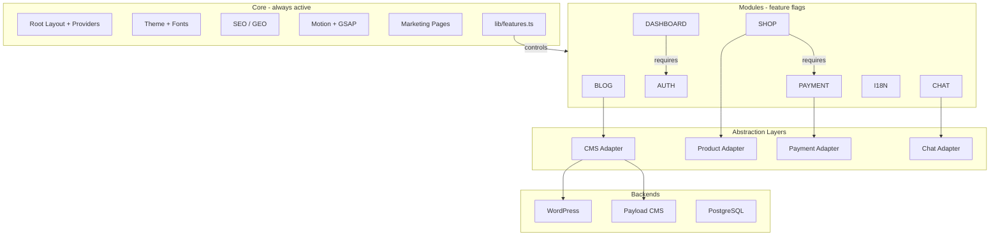

# Bazasite Architecture

## 1. Overview

Bazasite is a modular Next.js 16 project that uses a **Core + Modules** architecture. The Core layer is always active and provides the foundational infrastructure: root layout, theming, fonts, SEO, animations, marketing pages, and feature-flag logic. Modules are optional feature bundles (Blog, Auth, Dashboard, Shop, Chat, Payment, I18n) that can be toggled on or off via feature flags defined in `lib/features.ts`.

When a module is disabled, its routes return a 404, its layouts are not rendered, and any backend adapters for that module remain unused. This design allows the same codebase to serve as a simple marketing site, a blog, a shop, or a full application by changing configuration rather than code.

---

## 2. Architecture Diagram

---

## 3. Route Groups

Bazasite uses Next.js route groups, denoted by parentheses (e.g. `(marketing)`, `(blog)`). Route groups do not affect the URL path: `(marketing)/about/page.tsx` resolves to `/about`, and `(blog)/blog/[slug]/page.tsx` resolves to `/blog/[slug]`. They are used only to organize code and apply shared layouts.

| Route Group   | Purpose                                                    | URL Examples                |
|---------------|------------------------------------------------------------|-----------------------------|
| `(marketing)` | Public marketing pages: home, about, contact, CMS slugs     | `/`, `/about`, `/contact`, `/[slug]` |
| `(blog)`      | Blog listing and posts; uses CMS adapter for content       | `/blog`, `/blog/[slug]`     |
| `(auth)`      | Login, register, forgot-password; Better Auth integration  | `/login`, `/register`, `/forgot-password` |
| `(dashboard)` | Authenticated user area: dashboard, profile, settings, orders | `/dashboard`, `/profile`, `/settings`, `/orders` |
| `(shop)`      | Product catalog, cart, checkout; requires Payment when enabled | `/products`, `/cart`, `/checkout` |

Each module layout checks its feature flag (e.g. `FEATURE_BLOG`, `FEATURE_SHOP`) and calls `notFound()` if the module is disabled. This keeps the URL structure consistent and prevents access to modules that are not configured.

---

## 4. Request Flow

A typical request flows through the following layers:

1. **Browser** – User navigates or submits a request.

2. **proxy.ts** – Middleware runs before the request is handled. It performs auth-related checks (e.g. validating cookies, redirecting unauthenticated users away from protected routes). The file name `proxy.ts` reflects its role as the entry point for request interception.

3. **Root Layout** (`app/layout.tsx`) – Wraps the entire application. Loads providers (Theme, Auth, etc.), fonts, and base metadata. All route groups and pages render inside this layout.

4. **Route Group Layout** – Applies layout specific to the segment. Marketing uses a shared header/footer; Dashboard uses a sidebar; Auth uses a minimal layout. The layout is chosen based on the matched route group.

5. **Page Component** – Renders the actual page content. Fetches data via the abstraction layers (CMS, Shop, Payment, Chat) where needed.

6. **Abstraction Layer** – Components and server functions call adapters (e.g. `lib/cms/index.ts`, `lib/shop/index.ts`) rather than backends directly. The adapter interface hides the concrete implementation.

7. **Backend** – The adapter talks to WordPress, Payload CMS, PostgreSQL, or other services based on environment configuration.

---

## 5. Key Files Reference

| File | Layer | Purpose |
|------|-------|---------|
| `lib/features.ts` | Core | Feature flags for modules (BLOG, AUTH, DASHBOARD, SHOP, CHAT, PAYMENT, I18N). Controls which modules are enabled. |
| `lib/cms/index.ts` | Core | CMS adapter factory. Exports a unified interface for fetching pages and blog posts; switches between WordPress and Payload based on env. |
| `lib/shop/index.ts` | Module: Shop | Shop abstraction. Product listing, cart logic, checkout flow. Used by the (shop) route group. |
| `lib/payment/index.ts` | Module: Payment | Payment adapter. Processes payments and webhook handling. Required when Shop is enabled. |
| `lib/chat/index.ts` | Module: Chat | Chat adapter. Powers the ChatWidget; integrates with the chat backend when enabled. |
| `lib/auth.ts` | Module: Auth | Better Auth server configuration. Session handling, providers, and server-side auth logic. |
| `proxy.ts` | Core | Middleware. Auth cookie checks, redirects for protected routes. Runs before every request. |
| `app/layout.tsx` | Core | Root layout. Wraps all pages with providers, fonts, and base metadata. |
| `app/sitemap.ts` | Core | Dynamic sitemap generation. Includes marketing pages, blog posts, and product URLs when modules are enabled. |
| `app/robots.ts` | Core | Robots.txt generation. Controls crawl access for SEO and preview environments. |
| `components/providers/app-providers.tsx` | Core | Composes ThemeProvider, AuthProvider, and other context providers used by the root layout. |

---

## 6. Abstraction Pattern

Bazasite uses an **adapter pattern** across CMS, Shop, Payment, and Chat. The pattern consists of:

1. **Interface definition** – A TypeScript interface describes the contract (e.g. `getPage(slug)`, `getPosts()`, `createCheckout()`) without specifying the backend.

2. **Adapter implementations** – Each backend has its own adapter file (e.g. `lib/cms/wordpress.ts`, `lib/cms/payload.ts`) that implements the interface and talks to the real service.

3. **Factory function** – A central entry point (e.g. `lib/cms/index.ts`) reads an environment variable (e.g. `CMS_PROVIDER`) and returns the appropriate adapter instance. Adapters are lazy-loaded to avoid importing unused code.

4. **Mock adapters** – When no backend is configured or the module is disabled, the factory can return a mock adapter that returns empty arrays, null, or safe default values. The app remains functional (e.g. blog shows no posts, shop shows no products) without runtime errors, which simplifies local development and CI.

This pattern keeps backend-specific logic isolated, makes testing easier, and allows switching providers by changing configuration rather than code.
