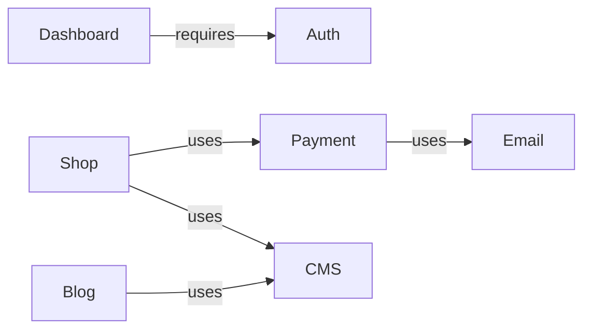

# Modules Reference

## Module Dependencies



## AUTH Module

- **Purpose**: User authentication (sign in, sign up, password reset)
- **Flag**: `NEXT_PUBLIC_FEATURE_AUTH=true`
- **Files**:
  - `src/lib/auth.ts` — Better Auth server config (email/password, OAuth providers)
  - `src/lib/auth-client.ts` — React client (`signIn`, `signUp`, `signOut`, `useSession`)
  - `src/app/api/auth/[...all]/route.ts` — API route handler (rate-limited)
  - `src/app/(auth)/` — Login, register, forgot-password pages
  - `middleware.ts` — Cookie check for protected routes
- **Key interfaces**: Better Auth handles types internally
- **Dependencies**: None (standalone)
- **Validation schemas**: `src/lib/validations/auth.ts` — `loginSchema`, `registerSchema`, `forgotPasswordSchema`

## BLOG Module

- **Purpose**: Blog listing and article pages with CMS content
- **Flag**: `NEXT_PUBLIC_FEATURE_BLOG=true`
- **Files**:
  - `src/app/(blog)/layout.tsx` — Layout with feature guard
  - `src/app/(blog)/blog/page.tsx` — Blog listing
  - `src/app/(blog)/blog/[slug]/page.tsx` — Article page with SEO metadata
- **Key interfaces**: Uses `CMSAdapter.getPosts()`, `CMSAdapter.getPostBySlug()`
- **Dependencies**: Requires `CMS_PROVIDER` != none for real content (works with mock adapter otherwise)

## DASHBOARD Module

- **Purpose**: User dashboard with profile, settings, orders
- **Flag**: `NEXT_PUBLIC_FEATURE_DASHBOARD=true`
- **Files**:
  - `src/app/(dashboard)/layout.tsx` — Sidebar layout with auth check
  - `src/app/(dashboard)/dashboard/page.tsx` — Overview
  - `src/app/(dashboard)/profile/page.tsx` — Profile form
  - `src/app/(dashboard)/settings/page.tsx` — Settings + danger zone
  - `src/app/(dashboard)/orders/page.tsx` — Order history (visible if SHOP enabled)
- **Key interfaces**: Uses `auth.api.getSession()` for session validation
- **Dependencies**: Requires AUTH module enabled

## SHOP Module

- **Purpose**: Product catalog, cart, checkout
- **Flag**: `NEXT_PUBLIC_FEATURE_SHOP=true`
- **Files**:
  - `src/lib/shop/types.ts` — `Product`, `CartItem`, `Order`, `ProductAdapter` interfaces
  - `src/lib/shop/cart.ts` — Cart state (useSyncExternalStore + localStorage)
  - `src/lib/shop/index.ts` — Factory function `getShop()`
  - `src/app/(marketing)/catalog/page.tsx` — Каталог (данные из `getShop()`)
  - `src/app/(shop)/products/page.tsx` — редирект на `/catalog`
  - `src/app/(shop)/products/[slug]/page.tsx` — Product detail with JSON-LD
  - `src/app/(shop)/cart/page.tsx` — Cart
  - `src/app/(shop)/checkout/page.tsx` — Checkout
- **Key interfaces**: `ProductAdapter` (getProducts, getProductBySlug, getProductCategories, searchProducts)
- **Dependencies**: Uses PAYMENT for checkout flow

## PAYMENT Module

- **Purpose**: Payment processing abstraction
- **Flag**: `NEXT_PUBLIC_FEATURE_PAYMENT=true`
- **Env**: `PAYMENT_PROVIDER=stripe|yookassa|none`
- **Files**:
  - `src/lib/payment/types.ts` — `PaymentCheckout`, `PaymentAdapter` interfaces
  - `src/lib/payment/index.ts` — Factory function `getPayment()`
  - `src/lib/payment/stripe.ts` — Stripe adapter implementation
  - `src/lib/payment/yookassa.ts` — YooKassa adapter implementation
  - `src/app/api/payment/webhook/route.ts` — Webhook endpoint (with Pino logging)
- **Key interfaces**: `PaymentAdapter` (createCheckout, verifyWebhook, getPaymentStatus)
- **Dependencies**: None (standalone)

### Using Stripe

```env
PAYMENT_PROVIDER=stripe
STRIPE_SECRET_KEY=sk_test_xxx
STRIPE_PUBLISHABLE_KEY=pk_test_xxx
STRIPE_WEBHOOK_SECRET=whsec_xxx
```

### Using YooKassa

```env
PAYMENT_PROVIDER=yookassa
YOOKASSA_SHOP_ID=123456
YOOKASSA_SECRET_KEY=test_xxx
YOOKASSA_WEBHOOK_SECRET=xxx
```

## CHAT Module

- **Purpose**: Floating chat widget on all marketing pages
- **Flag**: `NEXT_PUBLIC_FEATURE_CHAT=true`
- **Env**: `CHAT_PROVIDER=tawkto|intercom|custom|none`
- **Files**:
  - `src/lib/chat/types.ts` — `ChatMessage`, `ChatAdapter` interfaces
  - `src/lib/chat/index.ts` — Factory function `getChat()`
  - `src/lib/chat/tawkto.ts` — Tawk.to adapter (embedded widget script)
  - `src/lib/chat/intercom.ts` — Intercom adapter (embedded widget script)
  - `src/components/chat/chat-widget.tsx` — Floating widget component
- **Key interfaces**: `ChatAdapter` (sendMessage, getHistory, onMessage)
- **Dependencies**: None (standalone)

### Using Tawk.to

```env
CHAT_PROVIDER=tawkto
NEXT_PUBLIC_TAWKTO_PROPERTY_ID=your_property_id
NEXT_PUBLIC_TAWKTO_WIDGET_ID=default
```

### Using Intercom

```env
CHAT_PROVIDER=intercom
NEXT_PUBLIC_INTERCOM_APP_ID=your_app_id
```

## EMAIL Module

- **Purpose**: Transactional email sending (password reset, order confirmation, contact form)
- **Env**: `EMAIL_PROVIDER=resend|none`
- **Files**:
  - `src/lib/email/types.ts` — `EmailAdapter`, `EmailMessage` interfaces
  - `src/lib/email/index.ts` — Factory function `getEmail()` + mock adapter
  - `src/lib/email/resend.ts` — Resend adapter implementation
- **Key interfaces**: `EmailAdapter` (send)
- **Dependencies**: None (standalone)

### Usage

```typescript
import { getEmail } from '@/lib/email'

const email = await getEmail()
await email.send({
  to: 'user@example.com',
  subject: 'Welcome!',
  html: '<h1>Welcome to our site</h1>',
})
```

### Using Resend

```env
EMAIL_PROVIDER=resend
RESEND_API_KEY=re_xxx
EMAIL_FROM=noreply@yourdomain.com
```

When `EMAIL_PROVIDER=none` (default), emails are logged to console via the mock adapter.

## I18N Module

- **Purpose**: Internationalization with locale routing
- **Flag**: `NEXT_PUBLIC_FEATURE_I18N=true`
- **Files**:
  - `src/i18n/routing.ts` — Locale routing config (reads NEXT_PUBLIC_LOCALES env)
  - `src/i18n/request.ts` — Server request config
  - `messages/en.json` — English translations (comprehensive: auth, dashboard, shop, blog, contact, errors, etc.)
  - `messages/ru.json` — Russian translations (same keys)
- **Key interfaces**: Uses next-intl `defineRouting`, `getRequestConfig`
- **Dependencies**: None (standalone)

### Translation keys

Translations cover all major sections:

| Namespace   | Keys                                                       |
| ----------- | ---------------------------------------------------------- |
| `common`    | Navigation, actions (save, cancel, delete), loading states |
| `auth`      | Login, register, forgot password, form fields, errors      |
| `dashboard` | Overview, stats, recent orders                             |
| `profile`   | Edit profile, avatar, personal info                        |
| `settings`  | Preferences, notifications, danger zone                    |
| `shop`      | Product cards, cart, checkout, filters                     |
| `blog`      | Article list, reading time, categories                     |
| `contact`   | Contact form fields, success/error messages                |
| `cookies`   | Cookie consent banner text                                 |
| `search`    | Search page, placeholder, no results                       |
| `errors`    | 404, 500, generic errors                                   |
| `upload`    | File upload labels, size limits                            |

## Shared UI Components

These components are available across all modules:

| Component        | File                                         | Purpose                                   |
| ---------------- | -------------------------------------------- | ----------------------------------------- |
| Skeleton loaders | `src/components/skeletons/card-skeleton.tsx` | Blog, product, dashboard, table skeletons |
| File upload      | `src/components/file-upload.tsx`             | Drag-and-drop with progress bar           |
| Cookie consent   | `src/components/cookie-consent.tsx`          | GDPR banner with accept/decline           |
| Toast            | `sonner` via `AppProviders`                  | Notifications (`toast('Message')`)        |
| Search           | `src/app/(marketing)/search/`                | Search page + API route                   |

## Form Validation Schemas

Reusable Zod schemas for common forms:

| Schema                 | File                             | Fields                                 |
| ---------------------- | -------------------------------- | -------------------------------------- |
| `loginSchema`          | `src/lib/validations/auth.ts`    | email, password                        |
| `registerSchema`       | `src/lib/validations/auth.ts`    | name, email, password, confirmPassword |
| `forgotPasswordSchema` | `src/lib/validations/auth.ts`    | email                                  |
| `contactSchema`        | `src/lib/validations/contact.ts` | name, email, subject?, message         |

Usage with react-hook-form:

```typescript
import { useForm } from 'react-hook-form'
import { zodResolver } from '@hookform/resolvers/zod'
import { loginSchema, type LoginInput } from '@/lib/validations/auth'

const form = useForm<LoginInput>({
  resolver: zodResolver(loginSchema),
})
```

## The Adapter Pattern

All external integrations follow the same pattern:

```
src/lib/{module}/
├── types.ts    # Interface definition
├── index.ts    # Factory function with provider switch
├── stripe.ts   # Implementation A
└── yookassa.ts # Implementation B
```

To add a new adapter (e.g., PayPal payment):

1. Implement the interface in `src/lib/payment/paypal.ts`
2. Add `'paypal'` to the provider enum in `src/lib/payment/index.ts`
3. Import and register in the factory switch
4. Add env vars to `.env.example` and `src/lib/env.ts`
