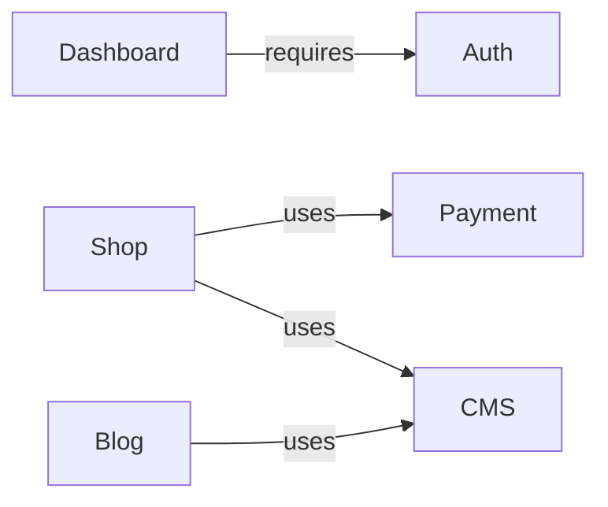

# Modules Reference

## Module Dependencies

## AUTH Module

- **Purpose**: User authentication (sign in, sign up, password reset)
- **Flag**: `NEXT_PUBLIC_FEATURE_AUTH=true`
- **Files**:
  - `src/lib/auth.ts` -- Better Auth server config (email/password, OAuth providers)
  - `src/lib/auth-client.ts` -- React client (`signIn`, `signUp`, `signOut`, `useSession`)
  - `src/app/api/auth/[...all]/route.ts` -- API route handler
  - `src/app/(auth)/` -- Login, register, forgot-password pages
  - `proxy.ts` -- Cookie check for protected routes
- **Key interfaces**: Better Auth handles types internally
- **Dependencies**: None (standalone)

## BLOG Module

- **Purpose**: Blog listing and article pages with CMS content
- **Flag**: `NEXT_PUBLIC_FEATURE_BLOG=true`
- **Files**:
  - `src/app/(blog)/layout.tsx` -- Layout with feature guard
  - `src/app/(blog)/blog/page.tsx` -- Blog listing
  - `src/app/(blog)/blog/[slug]/page.tsx` -- Article page with SEO metadata
- **Key interfaces**: Uses `CMSAdapter.getPosts()`, `CMSAdapter.getPostBySlug()`
- **Dependencies**: Requires `CMS_PROVIDER` != none for real content (works with mock adapter otherwise)

## DASHBOARD Module

- **Purpose**: User dashboard with profile, settings, orders
- **Flag**: `NEXT_PUBLIC_FEATURE_DASHBOARD=true`
- **Files**:
  - `src/app/(dashboard)/layout.tsx` -- Sidebar layout with auth check
  - `src/app/(dashboard)/dashboard/page.tsx` -- Overview
  - `src/app/(dashboard)/profile/page.tsx` -- Profile form
  - `src/app/(dashboard)/settings/page.tsx` -- Settings + danger zone
  - `src/app/(dashboard)/orders/page.tsx` -- Order history (visible if SHOP enabled)
- **Key interfaces**: Uses `auth.api.getSession()` for session validation
- **Dependencies**: Requires AUTH module enabled

## SHOP Module

- **Purpose**: Product catalog, cart, checkout
- **Flag**: `NEXT_PUBLIC_FEATURE_SHOP=true`
- **Files**:
  - `src/lib/shop/types.ts` -- `Product`, `CartItem`, `Order`, `ProductAdapter` interfaces
  - `src/lib/shop/cart.ts` -- Cart state (useSyncExternalStore + localStorage)
  - `src/lib/shop/index.ts` -- Factory function `getShop()`
  - `src/app/(shop)/products/page.tsx` -- Catalog
  - `src/app/(shop)/products/[slug]/page.tsx` -- Product detail with JSON-LD
  - `src/app/(shop)/cart/page.tsx` -- Cart
  - `src/app/(shop)/checkout/page.tsx` -- Checkout
- **Key interfaces**: `ProductAdapter` (getProducts, getProductBySlug, getProductCategories, searchProducts)
- **Dependencies**: Uses PAYMENT for checkout flow

## CHAT Module

- **Purpose**: Floating chat widget on all marketing pages
- **Flag**: `NEXT_PUBLIC_FEATURE_CHAT=true`
- **Files**:
  - `src/lib/chat/types.ts` -- `ChatMessage`, `ChatAdapter` interfaces
  - `src/lib/chat/index.ts` -- Factory function `getChat()`
  - `src/components/chat/chat-widget.tsx` -- Floating widget component
- **Key interfaces**: `ChatAdapter` (sendMessage, getHistory, onMessage)
- **Dependencies**: None (standalone). Currently a placeholder -- connect Intercom, Tawk.to, or custom WebSocket.

## PAYMENT Module

- **Purpose**: Payment processing abstraction
- **Flag**: `NEXT_PUBLIC_FEATURE_PAYMENT=true`
- **Files**:
  - `src/lib/payment/types.ts` -- `PaymentCheckout`, `PaymentAdapter` interfaces
  - `src/lib/payment/index.ts` -- Factory function `getPayment()`
  - `src/app/api/payment/webhook/route.ts` -- Webhook endpoint
- **Key interfaces**: `PaymentAdapter` (createCheckout, verifyWebhook, getPaymentStatus)
- **Dependencies**: None (standalone). Currently a placeholder -- implement Stripe or YooKassa adapter.

## I18N Module

- **Purpose**: Internationalization with locale routing
- **Flag**: `NEXT_PUBLIC_FEATURE_I18N=true`
- **Files**:
  - `src/i18n/routing.ts` -- Locale routing config (reads NEXT_PUBLIC_LOCALES env)
  - `src/i18n/request.ts` -- Server request config
  - `messages/en.json` -- English translations
  - `messages/ru.json` -- Russian translations
- **Key interfaces**: Uses next-intl `defineRouting`, `getRequestConfig`
- **Dependencies**: None (standalone)
